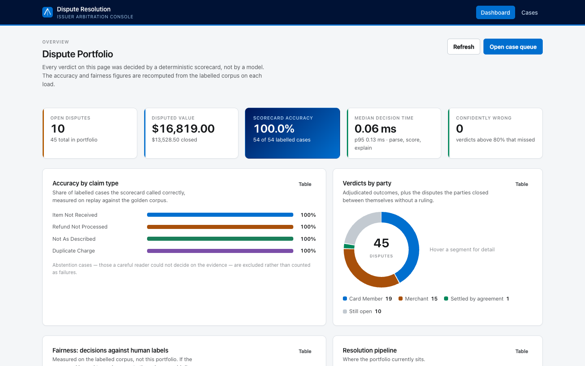
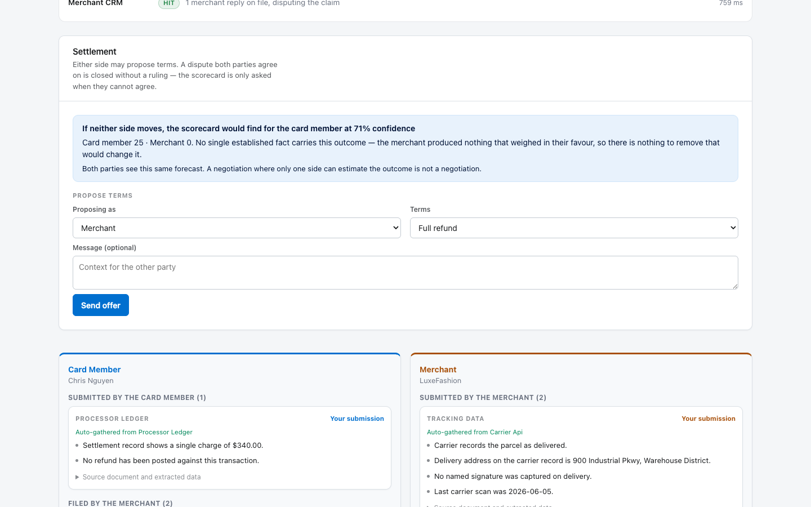
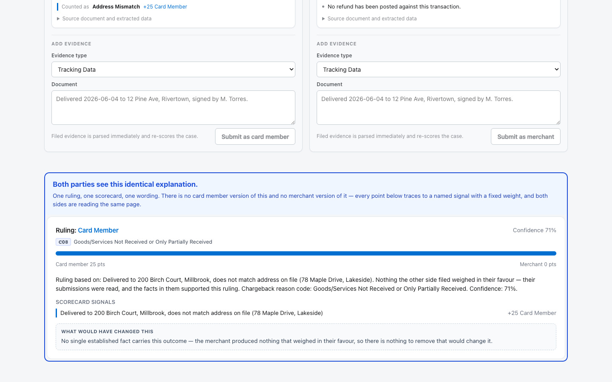

# Arbiter — Frictionless Dispute & Chargeback Resolution

**A neutral arbiter for card-charge disputes.** It auto-gathers the evidence, weighs it with a deterministic scorecard, and hands the card member and the merchant *the same explanation for the same verdict* — in seconds rather than weeks.

Built for **American Express CodeStreet 2026**, track: *Frictionless Dispute & Chargeback Resolution*.



---

## The problem

A card member disputes a charge. Then:

- The merchant gets **weeks** to respond, and the card member is out of pocket meanwhile.
- A human analyst eventually reads shipping records, policies and correspondence and issues an outcome.
- **Neither party is told which fact decided it.**

**This is not fraud detection.** The transaction is genuine — the disagreement is about what happened *next*. Was it delivered? Was it as described? Was the refund processed? Two legitimate accounts conflict, and somebody has to arbitrate between them.

### Why this space is empty

| What exists today | What it does | Whose side it's on |
|---|---|---|
| Chargeflow, Justt, ChargePay, Chargebacks911 | Auto-drafts evidence responses to win disputes | The merchant |
| Visa CE 3.0 + Verifi, Mastercard Ethoca | Shares data to stop a dispute escalating | Neither — it's plumbing |
| Risk dashboards with "explainability" | Shows score drivers to *internal analysts* | The institution |

Nobody occupies the neutral, two-sided, transparent seat: an issuer-run arbiter that shows **both** disputing parties the same evidence-based reasoning. That is what this is.

---

## The one architectural commitment

> **The LLM extracts typed facts and narrates the verdict. A deterministic scorecard decides it.**

```
messy evidence ──LLM──▶ typed facts ──scorecard──▶ verdict ──LLM──▶ plain-English narration
                                          ▲
                                 the decision lives HERE
                                 25 named signals, one table
```

The decision never sits inside the model. Everything follows from that:

- Every point in every verdict traces to a **named signal with a fixed weight**.
- The same evidence always produces the same answer — verdicts are reproducible.
- Fairness properties can be **proved and tested**, not asserted.
- Delete the API key and the verdicts are byte-identical. That is how the whole test suite runs.

---

## Quick start

**One process — the API also serves the built frontend:**

```bash
cd backend
python3 -m venv venv && source venv/bin/activate
pip install -r requirements.txt
python -m app.seed
uvicorn app.main:app --port 8000     # → http://localhost:8000
```

That is exactly what runs in production. For frontend development you want hot
reload instead, which needs the two processes:

```bash
uvicorn app.main:app --port 8000   # terminal one, from backend/
npm install && npm run dev         # terminal two, from frontend/ → :5173
```

`ANTHROPIC_API_KEY` is **optional**. Set it for LLM-backed parsing and narration; without it a deterministic offline parser takes over and the whole app still works. The demo is designed to run with no network at all.

> Schema changes between versions and SQLAlchemy cannot `ALTER` tables. If you see `no such column`, run `rm backend/disputes.db && python -m app.seed`.

---

## See it work

```bash
cd backend
pytest tests -q             # 92 tests
python -m app.evaluate      # accuracy, fairness, calibration, latency
python verify_examples.py   # 27 worked examples: input, expected, actual
curl localhost:8000/api/metrics  # the same figures, live
```

`verify_examples.py` is the fastest way to judge this without reading the code. It prints every input, what should happen, and what did:

```
PASS  tracking: "Not signed by anyone."              expected: None
PASS  policy: "All sales are final. No refunds."     expected: False
PASS  email: "Sorry, we cannot help you..."          expected: False   (not an admission)
PASS  duplicate confirmed BUT already refunded       expected: merchant 0–55
```

---

## How it works

**Five stages. Adjudication is the fallback, not the first move.**

### 1 · Gather

Filing a dispute fans out across four routed sources — carrier tracking, the Amex processor ledger, the merchant returns-policy API, and the merchant CRM. **Hits and misses are both logged**, because an adverse inference against a party is only fair when the record shows their systems were asked and returned nothing.

Sources with no hand-written fixture fall back to deterministic synthesis keyed off the transaction id, so a dispute filed live during a demo gathers real evidence instead of nothing.

### 2 · Extract

Each document becomes typed facts. The offline parser is not a stub — it handles signature negation (`"Not signed by anyone"` → no signature), generic signees (`"Receiving Dept"` is a role, not a person), three-state refund policies, and the difference between an admission of fault and ordinary politeness.

Facts it cannot establish come back as `None`, so the scorer awards nothing rather than guessing.

### 3 · Negotiate

Either party proposes terms — full refund, partial refund, replacement, or withdraw. A counter supersedes the offer it answers; superseded offers are kept so the thread stays auditable. **A settlement both sides accept closes the case with no verdict at all.**

Both parties see an identical **forecast** of what the scorecard would rule on the current evidence, including the counterfactual. A negotiation where only one side can estimate the outcome is not a negotiation.



### 4 · Score

25 signals in one auditable `SIGNAL_CATALOG`. A selection:

| Signal | Favours | Weight |
|---|---|---|
| `duplicate_settlement_confirmed` — two captured settlements, no offsetting refund | Card member | 35 |
| `not_shipped` — carrier never scanned the parcel | Card member | 30 |
| `refund_already_issued` — ledger shows the refund was posted | Merchant | 30 |
| `address_match` / `address_mismatch` | either | 25 |
| `photo_shows_damage` | Card member | 25 |
| `delivery_confirmation_named` — signed by the card member | Merchant | 20 |
| `delivery_confirmation_thirdparty` — signed by someone else | Merchant | 8 |

Confidence is **evidence-mass aware**: `margin × (0.5 + 0.5 × min(1, total/60))`. A 15–0 split off a single procedural signal reports 62%, not 100%.

### 5 · Explain



Four layers, in increasing order of usefulness to the party who just lost:

1. **Signal breakdown** — every point, named, attributed to the document it came from.
2. **Amex reason code** — C02 / C08 / C31 / C32 / P08, derived deterministically and checked against published Amex references.
3. **The counterfactual** — *"This would have gone the other way if these had not been established (−45 points)…"* Computed by arithmetic over the scorecard (`minimal_flip_set`), so it **cannot hallucinate**. It answers the only question a losing party actually asks.
4. **The narrative** — required to name the losing side's strongest point and why it was outweighed.

Plus a **"recommended for human review"** flag when a party filed evidence that no rule reads, or confidence falls below 35%. A signature proves a box arrived, not what was inside it — the system says so rather than ruling confidently on a case no human could decide.

---

## Fairness, stated out loud

**The claim is not that the scorecard is unbiased.**

Ambiguous cases resolve to the card member, matching issuer provisional-credit practice. That default is deliberate — and it is printed on the verdict as a **zero-weight disclosure signal**, not hidden inside a comparison operator.

> The target is not a bias gap of zero. It is that **every point of directional bias traces to a rule stated out loud.**

`tests/test_fairness.py` runs two audits in CI:

- **Catalog asymmetry audit** — fails the build on any weight imbalance not documented with a written justification. Intentional asymmetries (a damage photo is worth more than its absence, 25 vs 15) live in an allow-list *in code*, with reasons.
- **Party-swap tests** — identical evidence must be worth the same regardless of who benefits.

---

## Results

| Metric | Value |
|---|---|
| **Accuracy** | **54/54 arbitrable cases** (6 abstentions excluded) |
| Corpus | 60 labelled cases — 20 adversarial, 18 contested, 16 clear, 6 unarbitrable |
| Fairness | `bias_gap` **0.000**, recall equal for both parties |
| Confidently wrong (≥80%) | **0** |
| Latency, parse + score + explain | p95 **0.12 ms** offline |
| Tests | 92 unit/API/fairness + 27 worked examples |

### Read 54/54 as a warning, not a trophy

The scorecard was **tuned against this corpus**. A perfect score means the corpus has stopped discriminating — not that the system is perfect. The number that would mean something is a score on cases nobody looked at while building. The defensible claim is *"no known failure mode is unhandled"*, which is considerably weaker.

Widening the corpus from 25 to 60 cases dropped accuracy to 91% and **exposed three real defects** — a near-tautological signal, a harness that aged against the wall clock, and two mislabelled cases. That is what a corpus is for.

---

## Project layout

```
backend/
  app/
    connectors.py    four simulated evidence sources + deterministic synthesis
    llm.py           LLM prompts and the offline parser that mirrors them
    scoring.py       SIGNAL_CATALOG, the scorer, counterfactual arithmetic
    reason_codes.py  Amex chargeback reason codes
    readable.py      typed facts → plain English for the parties
    evaluate.py      accuracy / fairness / calibration / latency harness
    routers/cases.py the API
  tests/
    goldens.json     60 labelled cases
    test_scoring.py  one test per behaviour + a regression per fixed defect
    test_api.py      end-to-end over a throwaway database
    test_fairness.py the two audits above
  verify_examples.py 27 worked examples with expected output

frontend/src/
  pages/Dashboard.jsx    portfolio analytics
  pages/CaseDetail.jsx   both party panels, live
  components/charts.jsx  inline SVG charts, no charting library
  theme.js               design tokens; the categorical ramp is CVD-validated

deck/                    the pitch deck and the script that generates it
```

---

## API

| Method | Path | Purpose |
|---|---|---|
| `GET` | `/api/cases` | queue, with a verdict summary per row |
| `GET` | `/api/cases/{id}` | full case: evidence, signals, verdict, offers, gather log |
| `POST` | `/api/cases/{id}/gather` | run the connectors (`?async_mode=true` to stream) |
| `POST` | `/api/cases/{id}/evidence` | file a document; withdraws a standing verdict |
| `POST` | `/api/cases/{id}/resolve` | adjudicate |
| `GET` | `/api/cases/{id}/forecast` | what the scorecard *would* rule; records nothing |
| `POST` | `/api/cases/{id}/offers` | propose settlement terms |
| `POST` | `/api/cases/{id}/offers/{offer_id}/respond` | accept or decline |
| `GET` | `/api/metrics` | accuracy, fairness, calibration, latency |

Interactive docs at `/docs`.

---

## Deploying

Three values are configurable, and **all three must be set** or a deployment renders but shows no data:

`render.yaml` deploys **one** service. The frontend is a prebuilt bundle committed at
`frontend/dist` and served by the same FastAPI process as the API, under a single
origin — which removes CORS, the build-time API URL and the second deployment all at
once. Those three were the source of every deployment failure this project hit, and
keeping npm off the build host removed the rest.

Rebuild the bundle after any frontend change:

```bash
cd frontend && VITE_API_URL= npm run build && git add -f dist
```

| Variable | Where | Purpose |
|---|---|---|
| `DATABASE_PATH` | backend, runtime | point at a mounted volume, or SQLite resets on restart |
| `CORS_ORIGINS` | backend, runtime | only needed if the frontend is hosted separately |

CI (`.github/workflows/ci.yml`) runs the suite, the accuracy report and the worked examples on every push — with **no API key**, because the offline path is what the demo runs, so that is the path worth proving.

---

## Known limitations

Stated plainly, because a system whose thesis is reporting its own uncertainty should demonstrate that about itself.

- **The 60 labels are the author's judgement**, not adjudicated ground truth.
- **100% is a warning sign**, as above. The scorer was tuned against the corpus it is measured on.
- **The four evidence sources are simulated.** Connector latencies are derived from a hash, not measured — they model network cost, they are not evidence of it.
- **No abstain verdict.** Six corpus cases are genuinely undecidable; the system still rules on them and flags for review rather than withholding.
- **Single-process concurrency.** Gather is serialised per case with an in-process lock; a multi-worker deployment would need a unique index instead.

---

## Stack

FastAPI · SQLAlchemy · SQLite · pytest · React 18 · Vite · Anthropic Claude API (optional)

No CSS framework, no component library, no charting library. The only runtime dependency beyond the app's own SQLite file is the optional Anthropic API.
